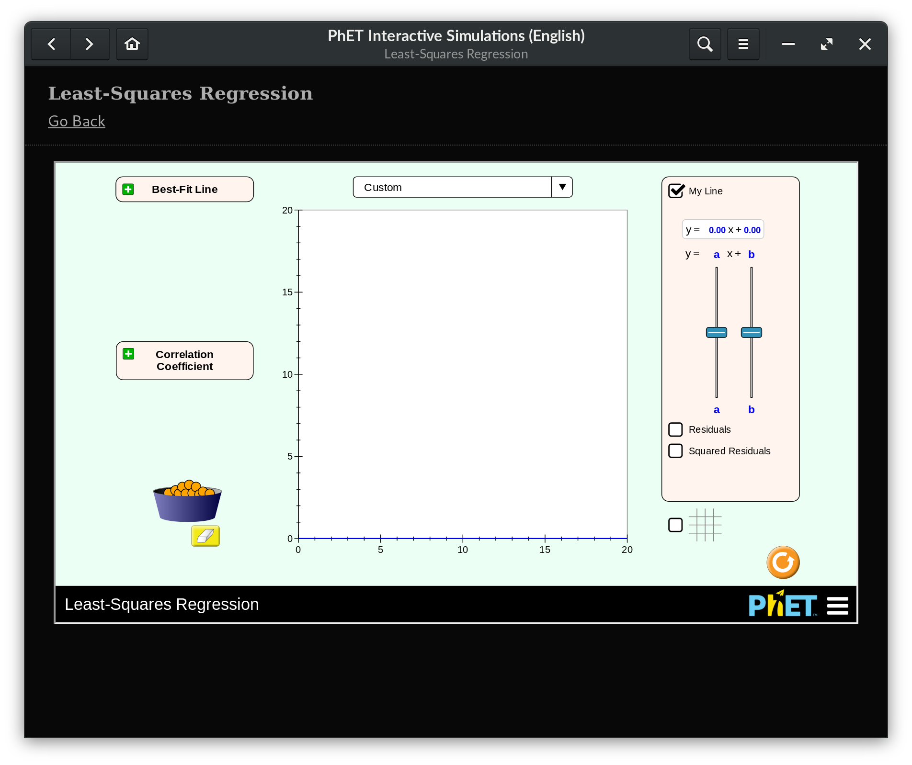

# kolibri-webview-demo

Demo of a Gtk+ based app that uses a webview to display content and a local Kolibri database as source of content.

## Usage

First, you have to install Kolibri and import a channel, then you need the channel ID, you can get it from the Kolibri URL when navigating to the channel root, so, for the URL `http://127.0.0.1:8080/es-es/learn/#/topics/1ceff53605e55bef987d88e0908658c5` the channel ID is going to be `1ceff53605e55bef987d88e0908658c5`.

I was not able to run the app in a virtualenv, but the only requirement you need is PyGObject and SQLAlchemy. Once those are visible in your Python environment just run:

    python3 -m kolibri_webview_demo <channel_id>

Alternatively, you can build and install the application as a Flatpak:

    flatpak-builder --install --user build com.endlessm.KolibriWebViewDemo.json
    flatpak run com.endlessm.KolibriWebViewDemo <channel_id>

The [the kolibri flatpak](https://flathub.org/apps/details/org.learningequality.Kolibri) installs content in a different path. To use the content already installed by the kolibri flatpak, run this demo with:

    flatpak run \
      --env=KOLIBRI_HOME=~/.var/app/org.learningequality.Kolibri/data/kolibri \
      --filesystem=~/.var/app/org.learningequality.Kolibri/data/kolibri \
      com.endlessm.KolibriWebViewDemo 197934f144305350b5820c7c4dd8e194

## Architecture

TODO

## Screenshot

